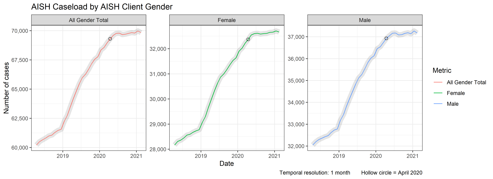
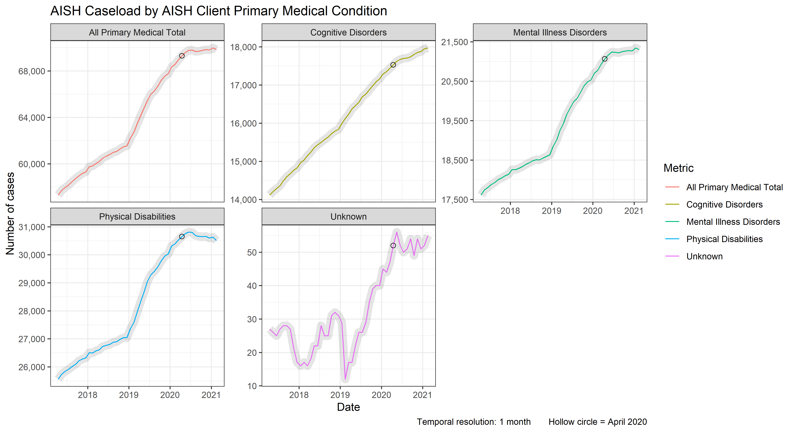
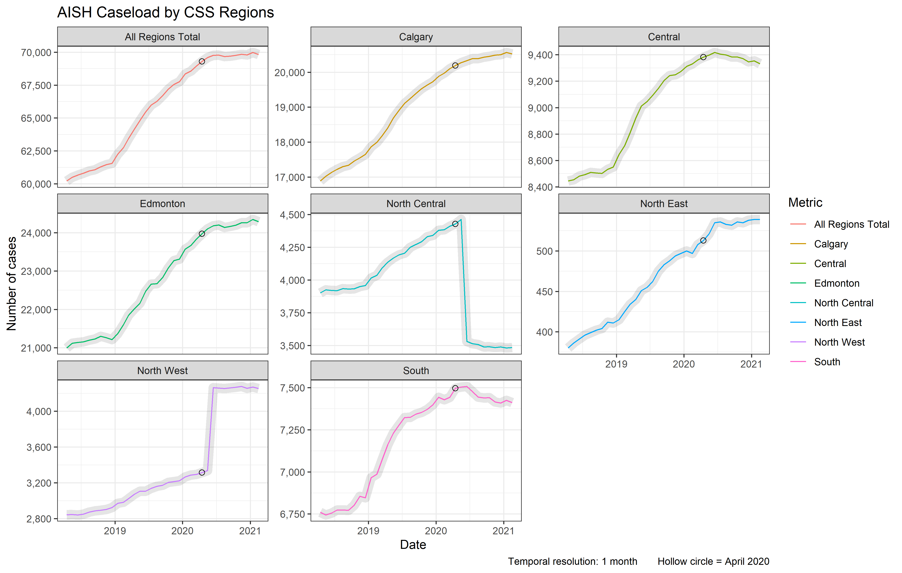
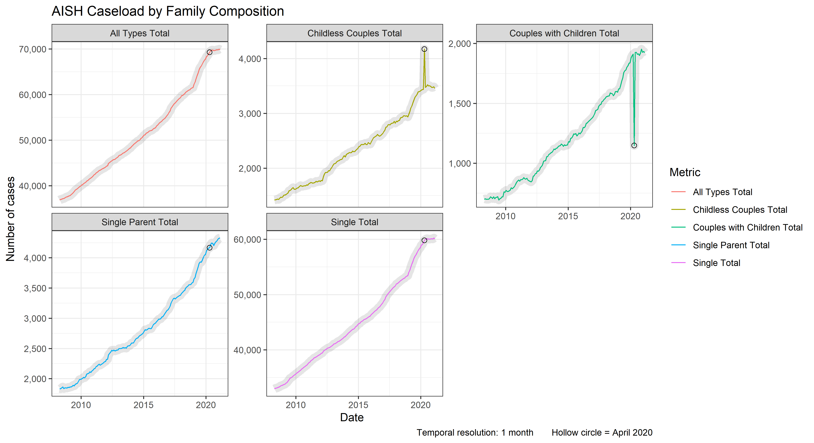
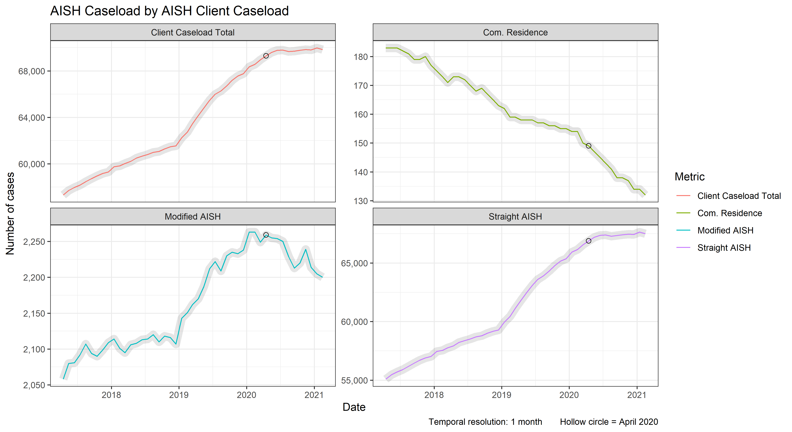
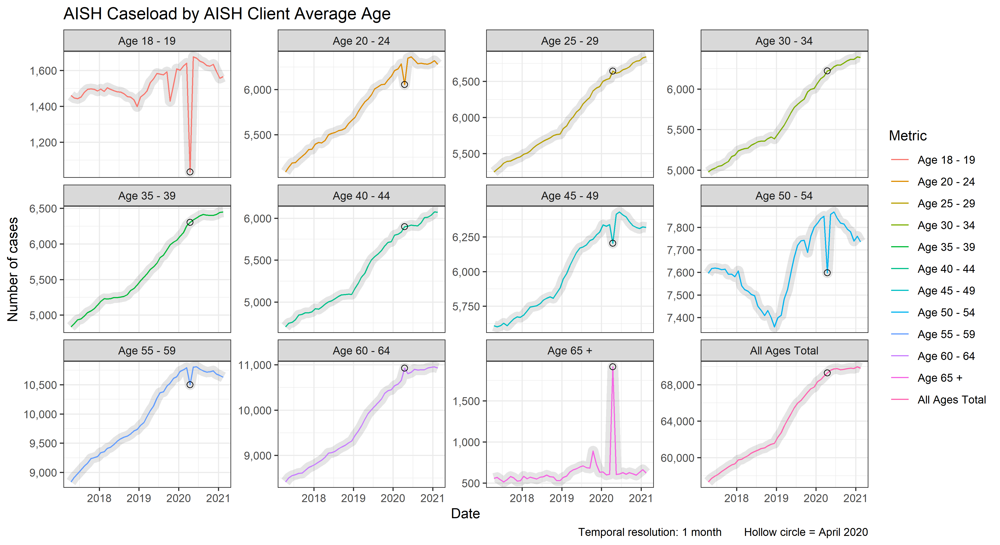
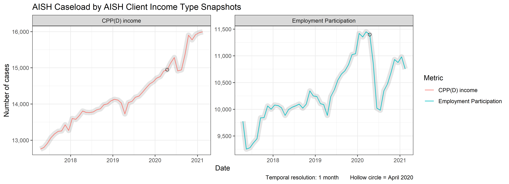

This report explores data on Assured Income for the Severely Handicapped (AISH) taken from the [open.alberta.ca](https://open.alberta.ca/opendata/assured-income-for-the-severely-handicapped-aish-caseload-alberta) portal.

<!--  Set the working directory to the repository's base directory; this assumes the report is nested inside of two directories.-->


<!-- Load the sources.  Suppress the output when loading sources. --> 


<!-- Load packages, or at least verify they're available on the local machine.  Suppress the output when loading packages. -->


<!-- Load any Global functions and variables declared in the R file.  Suppress the output. --> 


# Take away points 

## Observations

- Caseload experiences a stunted growth after the onset of COVID ( ~ March of 2020) (see [Gender](#gender). This may be explained by the introduction of the $2,000 monthly assistance to the unemployed due to COVID in April of 2020.  

- This explanation is corroborated in the caseload trends by [Medical Condition](#medical-condition): after April 2020 clients with Physical Disability exhibited a more pronounced plateau than those with Cognitive or Mental Illness Disorders.  

- This trend (stunted growth of caseloads after April 2020) is more pronounced in South and Central regions (see [Regions](#regions).  

- Employment Participation ([Income](#income)) drops precipitously after April 2020, but recovers to December 2019 levels by the end of 2021.  


## Potential Issues

Some of the observed trends are too drastic to invite an intuitive explanation and therefore are suspect of a data entry issue

- North Central and North West exhibit (see [Regions](#regions)) unnatural change from May to June of 2020. It's as if the data entry was swaped for them starting with June 2020.   

- There is an aberration in caseload among Childless Couples and Couples with Children (see [Family Composition](#family-composition)) for the month of April 2020. These are so uncharacteristi of the preceding and following trajectory that we suspect a data entry.   

- The same month, April 2020 stands out when caseload is broken by [Client Average Age](#age). Clients of Age 65+ exhibit a sharp spike in case counts, while clients of Age 18 - 19 show a sharp depression for that month. Other age groups (e.g. 20-24, 45-49, 50-54) also exhibit unnatural patters for the month of April 2020 that deviate sharply from previous and following trajectories. 


# Gender


# Medical Condition


# Regions



- __DATA ISSUE__: North Central and North West exhibit (see [Regions](#regions)) unnatural change from May to June of 2020. It's as if the data entry was swaped for them starting with June 2020.   


# Family Composition


- __DATA ISSUE__: There is an aberration in caseload among Childless Couples and Couples with Children (see [Family Composition](#family-composition)) for the month of April 2020. These are so uncharacteristi of the preceding and following trajectory that we suspect a data entry.  

# Caseload



# Age


- __DATA ISSUE__:  April 2020 stands out when caseload is broken by [Client Average Age](#age). Clients of Age 65+ exhibit a sharp spike in case counts, while clients of Age 18 - 19 show a sharp depression for that month. Other age groups (e.g. 20-24, 45-49, 50-54) also exhibit unnatural patters for the month of April 2020 that deviate sharply from previous and following trajectories.  

# Income



Session Information {#session-info}
===========================================================================

For the sake of documentation and reproducibility, the current report was rendered in the following environment.  Click the line below to expand.

<details>
  <summary>Environment <span class="glyphicon glyphicon-plus-sign"></span></summary>

```
Error in get(genname, envir = envir) : object 'testthat_print' not found
```

```
- Session info -----------------------------------------------------------------------------------
 setting  value                       
 version  R version 4.0.3 (2020-10-10)
 os       Windows 10 x64              
 system   x86_64, mingw32             
 ui       RTerm                       
 language (EN)                        
 collate  English_United States.1252  
 ctype    English_United States.1252  
 tz       America/New_York            
 date     2021-04-15                  

- Packages ---------------------------------------------------------------------------------------
 package     * version date       lib source        
 assertthat    0.2.1   2019-03-21 [1] CRAN (R 4.0.2)
 backports     1.1.7   2020-05-13 [1] CRAN (R 4.0.0)
 blob          1.2.1   2020-01-20 [1] CRAN (R 4.0.2)
 callr         3.4.3   2020-03-28 [1] CRAN (R 4.0.2)
 cli           2.0.2   2020-02-28 [1] CRAN (R 4.0.2)
 colorspace    1.4-1   2019-03-18 [1] CRAN (R 4.0.2)
 crayon        1.3.4   2017-09-16 [1] CRAN (R 4.0.2)
 DBI           1.1.0   2019-12-15 [1] CRAN (R 4.0.2)
 desc          1.2.0   2018-05-01 [1] CRAN (R 4.0.2)
 devtools      2.3.1   2020-07-21 [1] CRAN (R 4.0.2)
 digest        0.6.25  2020-02-23 [1] CRAN (R 4.0.2)
 dplyr       * 1.0.4   2021-02-02 [1] CRAN (R 4.0.3)
 ellipsis      0.3.1   2020-05-15 [1] CRAN (R 4.0.2)
 evaluate      0.14    2019-05-28 [1] CRAN (R 4.0.2)
 fansi         0.4.1   2020-01-08 [1] CRAN (R 4.0.2)
 farver        2.0.3   2020-01-16 [1] CRAN (R 4.0.2)
 forcats     * 0.5.0   2020-03-01 [1] CRAN (R 4.0.2)
 fs            1.5.0   2020-07-31 [1] CRAN (R 4.0.2)
 generics      0.1.0   2020-10-31 [1] CRAN (R 4.0.3)
 ggplot2     * 3.3.3   2020-12-30 [1] CRAN (R 4.0.3)
 glue          1.4.1   2020-05-13 [1] CRAN (R 4.0.2)
 gtable        0.3.0   2019-03-25 [1] CRAN (R 4.0.2)
 highr         0.8     2019-03-20 [1] CRAN (R 4.0.2)
 hms           0.5.3   2020-01-08 [1] CRAN (R 4.0.2)
 htmltools     0.5.0   2020-06-16 [1] CRAN (R 4.0.2)
 janitor     * 2.0.1   2020-04-12 [1] CRAN (R 4.0.2)
 knitr         1.31    2021-01-27 [1] CRAN (R 4.0.3)
 labeling      0.3     2014-08-23 [1] CRAN (R 4.0.0)
 lifecycle     0.2.0   2020-03-06 [1] CRAN (R 4.0.2)
 lubridate   * 1.7.9   2020-06-08 [1] CRAN (R 4.0.2)
 magrittr    * 1.5     2014-11-22 [1] CRAN (R 4.0.2)
 memoise       1.1.0   2017-04-21 [1] CRAN (R 4.0.2)
 munsell       0.5.0   2018-06-12 [1] CRAN (R 4.0.2)
 pillar        1.4.6   2020-07-10 [1] CRAN (R 4.0.2)
 pkgbuild      1.1.0   2020-07-13 [1] CRAN (R 4.0.2)
 pkgconfig     2.0.3   2019-09-22 [1] CRAN (R 4.0.2)
 pkgload       1.1.0   2020-05-29 [1] CRAN (R 4.0.2)
 prettyunits   1.1.1   2020-01-24 [1] CRAN (R 4.0.2)
 processx      3.4.3   2020-07-05 [1] CRAN (R 4.0.2)
 ps            1.3.4   2020-08-11 [1] CRAN (R 4.0.2)
 purrr         0.3.4   2020-04-17 [1] CRAN (R 4.0.3)
 R6            2.4.1   2019-11-12 [1] CRAN (R 4.0.2)
 Rcpp          1.0.5   2020-07-06 [1] CRAN (R 4.0.2)
 readr         1.4.0   2020-10-05 [1] CRAN (R 4.0.3)
 remotes       2.2.0   2020-07-21 [1] CRAN (R 4.0.2)
 rlang         0.4.10  2020-12-30 [1] CRAN (R 4.0.3)
 rmarkdown     2.7     2021-02-19 [1] CRAN (R 4.0.3)
 rprojroot     1.3-2   2018-01-03 [1] CRAN (R 4.0.2)
 rstudioapi    0.11    2020-02-07 [1] CRAN (R 4.0.2)
 scales        1.1.1   2020-05-11 [1] CRAN (R 4.0.3)
 sessioninfo   1.1.1   2018-11-05 [1] CRAN (R 4.0.2)
 snakecase     0.11.0  2019-05-25 [1] CRAN (R 4.0.2)
 stringi       1.4.6   2020-02-17 [1] CRAN (R 4.0.0)
 stringr     * 1.4.0   2019-02-10 [1] CRAN (R 4.0.3)
 testthat      2.3.2   2020-03-02 [1] CRAN (R 4.0.2)
 tibble        3.0.3   2020-07-10 [1] CRAN (R 4.0.2)
 tidyr       * 1.1.2   2020-08-27 [1] CRAN (R 4.0.3)
 tidyselect    1.1.0   2020-05-11 [1] CRAN (R 4.0.2)
 usethis       1.6.1   2020-04-29 [1] CRAN (R 4.0.2)
 vctrs         0.3.6   2020-12-17 [1] CRAN (R 4.0.3)
 withr         2.2.0   2020-04-20 [1] CRAN (R 4.0.2)
 xfun          0.21    2021-02-10 [1] CRAN (R 4.0.3)
 yaml          2.2.1   2020-02-01 [1] CRAN (R 4.0.2)

[1] C:/Users/an499583/OneDrive - University of Central Florida/Documents/R/win-library/4.0
[2] C:/Program Files/R/R-4.0.3/library
```
</details>


Report rendered by an499583 at 2021-04-15, 21:52 -0400 in 20 seconds.
